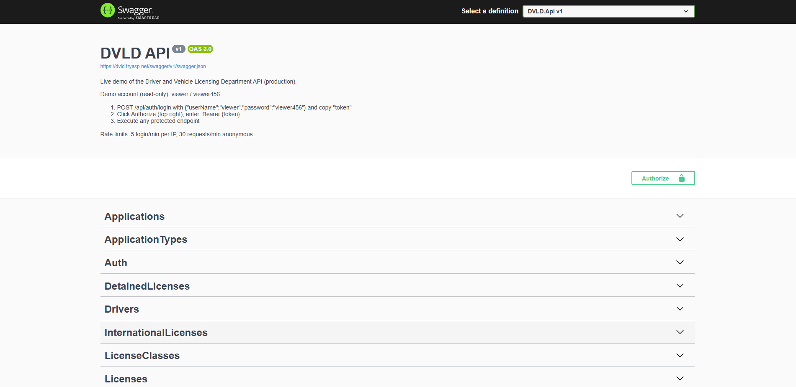

# 🪪 DVLD API

> A production-ready **Driver and Vehicle Licensing Department** API built with **ASP.NET Core 8**, **EF Core**, and **Clean Architecture**, modeling real government licensing regulations — not generic CRUD.

<p align="center">

[🌐 Live](https://dvld.tryasp.net/swagger)
•
[📖 Engineering Notes](AGENTS.md)

</p>

---


---

## 📸 Preview

<!-- Uncomment when docs/assets/swagger.png exists (screenshot of https://dvld.tryasp.net/swagger):

| Swagger UI (live) |
|:------------------|
|  |

-->

---

# Why This Project?

Most portfolio backends stop at CRUD. Government driver licensing doesn't — it's one of the rule-densest domains a system can model: five application types, a three-stage test pipeline (vision → written → street) with pass/fail gates, one-active-license-per-class enforcement, detention and renewal rules, and international permits issued only against valid local licenses.

I picked it to prove I can translate written regulations into enforced, tested code — business rules that live in services and guards, survive a 490-test suite, and run in production behind CI/CD. Not another to-do list.

---

# Live Demo

| Service | Link |
|---------|------|
| Health check | https://dvld.tryasp.net/health |
| **Swagger UI (interactive)** | **https://dvld.tryasp.net/swagger** |

**Demo account (read-only):** `viewer` / `viewer456`

1. Open Swagger → expand `POST /api/auth/login` → **Try it out** → enter `{"userName":"viewer","password":"viewer456"}` → **Execute** → copy `token`
2. Click **Authorize** (top right) → enter `Bearer {token}`
3. Execute any protected endpoint (e.g. `GET /api/people`) — real data from the live database

### Test it from your terminal (curl)

```bash
# 1. Liveness
curl https://dvld.tryasp.net/health

# 2. Login — returns token + refreshToken JSON
curl -X POST https://dvld.tryasp.net/api/auth/login -H "Content-Type: application/json" -d '{"userName":"viewer","password":"viewer456"}'

# 3. Authenticated call — paste the token from step 2
curl https://dvld.tryasp.net/api/people -H "Authorization: Bearer PASTE_TOKEN_HERE"
```

> Windows PowerShell note: type `curl.exe` instead of `curl` (PowerShell aliases `curl` to a different command).

Rate limits: 5 login attempts/min per IP, 30 requests/min anonymous (Swagger UI assets excluded). Backend only — no frontend yet.

---

# Key Features

## Licensing Domain

- Five application types: new, renewal, replacement, international permit, license release
- Three-stage test pipeline: Vision → Written → Street, with pass/fail gates between stages
- License lifecycle: Issue → Active → Detained → Released / Expired → Renewed
- One active license per class; detained licenses cannot be renewed
- International permits issued only against a valid local license
- Full audit trail: every action carries `CreatedByUserId` and timestamps

## Security

- JWT access tokens + refresh-token rotation (each refresh invalidates the previous — replay protection)
- BCrypt hashing (work factor 11); refresh tokens stored SHA-256 hashed — plaintext never persisted
- Role-based authorization: Admin / Officer / Viewer
- Rate limiting: global, auth (5/min/IP), sensitive (10/min) policies
- Global exception handler → consistent `ProblemDetails`; 500s never leak internals
- FluentValidation auto-validation: 20+ validators, zero manual wiring

## API Quality

- 14 controllers, one convention:

| Aspect | Convention | Example |
|---|---|---|
| Routes | `api/<plural-kebab>` | `api/local-driving-license-applications` |
| GET by ID | → 200 with DTO, 404 if missing | Every controller |
| GET list | → 200 with paginated result | Every controller |
| POST | → 201 with Location header | 12 controllers |
| DELETE | → 204 No Content | 10 controllers |

- Single-round-trip pagination: page + total count in one query, page size capped at 50
- `AsNoTracking` reads with DTO projection inside repositories
- Controllers stay thin — never touch `DbContext`, schema changes never leak upward

## Observability & Data

- 3 Serilog streams: app (14-day retention), security warnings (30-day), SQL commands (30-day)
- Every request timed by `RequestLoggingMiddleware` — no blind spots
- EF Core code-first: 15 entities, Fluent API configurations, migrations version-controlled
- `Restrict` deletes protect related data at the database level

---

# Technology Stack

## Backend

- ASP.NET Core 8
- Entity Framework Core 8
- SQL Server
- FluentValidation
- JWT + BCrypt
- Serilog

## DevOps

- GitHub Actions (CI/CD)
- MonsterASP.NET

---

# Architecture

The solution follows a layered architecture with strict dependency rules — the controller never touches `DbContext`, and database concerns never leak into business logic.

```
DVLD.Api             Controllers · middleware · JWT auth · DI config
   │
   ▼
DVLD.Business        Services · business rules · guards
   │
   ▼
DVLD.Contracts       DTOs · enums · interfaces · validators
   ▲
   │   (implemented by)
DVLD.DataAccess      EF Core · repositories · migrations
```

For the complete architecture conventions: ➡ **[AGENTS.md](AGENTS.md)**

---

# Engineering Highlights

✔ 4-project layered architecture

✔ 490 Automated Tests

✔ CI/CD Pipeline with auto-deploy

✔ Production Deployment

✔ JWT + Refresh-Token Rotation

✔ Role-Based Access Control

✔ 3-Policy Rate Limiting

✔ Global Exception Middleware

✔ FluentValidation Auto-Validation

✔ Single-Round-Trip Pagination

✔ AsNoTracking Query Optimization

✔ Structured 3-Stream Logging

✔ Self-Verifying Password Reset Gate

---

# Testing

Current test suite includes:

- Controller / integration tests (110)
- Service & business-rule tests (380)
- Validator tests
- Pagination, guards, and edge cases (null inputs, negative IDs, empty results)

Mocking with **NSubstitute**, assertions with **FluentAssertions**.

Result:

✅ **490 Passing Tests**

---

# Deployment

- CI/CD: GitHub Actions → build, test, Web Deploy
- Hosting: MonsterASP.NET
- HTTPS: enabled
- Health monitor: `GET /health`
- Config: environment variables in the hosting panel (never in git)

Full runbook: ➡ **[docs/deploy.md](docs/deploy.md)**

---

## Quick Start

```powershell
# Prerequisites: .NET 8 SDK, SQL Server

git clone https://github.com/A7medMubarak/dvld-api.git
cd dvld-api
dotnet build

# Database (once): dotnet ef database update --project src\DVLD.DataAccess --startup-project src\DVLD.Api
#                  sqlcmd -S . -d DVLD-EFCore -i database\seed.sql

dotnet run --project src/DVLD.Api   # Swagger: https://localhost:7247/swagger
dotnet test                          # 490 tests
```

---

# Project Structure

```
DVLD/
├── src/
│   ├── DVLD.Contracts/      DTOs, enums, interfaces, validators, options
│   ├── DVLD.DataAccess/     EF Core DbContext, entities, repositories, migrations
│   ├── DVLD.Business/       Service implementations, business rules, guards
│   └── DVLD.Api/            Controllers, middleware, JWT auth, DI config
├── tests/
│   ├── DVLD.Business.Tests/ Service-level unit tests
│   └── DVLD.Api.Tests/      Controller integration tests
├── database/                Seed script
├── docs/                    Smoke test, password reset, deployment runbooks
├── DVLD.sln
├── AGENTS.md                Architecture conventions & onboarding
└── README.md
```

---

# Engineering Documentation

This repository includes complete operational and engineering documentation:

- **AGENTS.md** — architecture conventions, DI registration, rate-limit policies, gotchas
- **docs/smoke-test.md** — 8-step production smoke test + rate-limit spot check
- **docs/password-reset.md** — self-verifying password reset (stored-hash gate)
- **docs/deploy.md** — full production deployment runbook (env vars, database, publish, verify)

---

# Roadmap

## Completed

- 4-project layered architecture
- JWT + refresh-token rotation
- 490 automated tests
- CI/CD with auto-deploy
- Production deployment (MonsterASP.NET)
- Rate limiting (3 policies)
- Structured 3-stream logging
- Live Swagger demo
- Verification gates (smoke test + stored-hash password gate)

## Planned

- Web frontend (React + Vite)
- Integration tests
- Docker Compose

---

# About Me

Hi, I'm **Ahmed**.

I'm transitioning into software engineering. DVLD is my proof that I can design, build, test, and document a production-grade REST API — from database schema and business rules to authentication, CI/CD, and a live deployment.

I'm currently seeking my first Software Engineer opportunity where I can contribute, continue learning, and grow alongside experienced engineers.

If you have feedback or would like to discuss the project, I'd be happy to connect.

[A7medMubarak](https://github.com/A7medMubarak)

---

⭐ If you found this project interesting, consider giving it a star.
